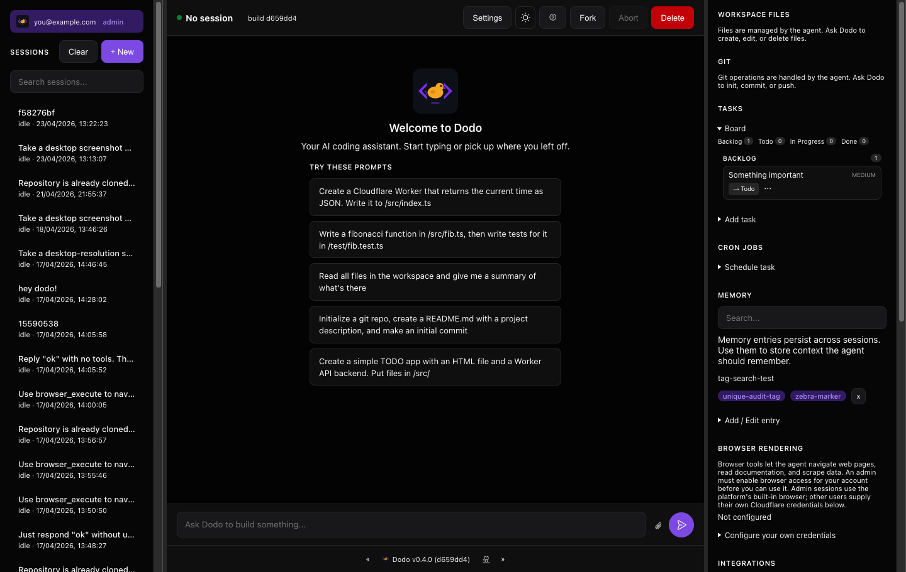
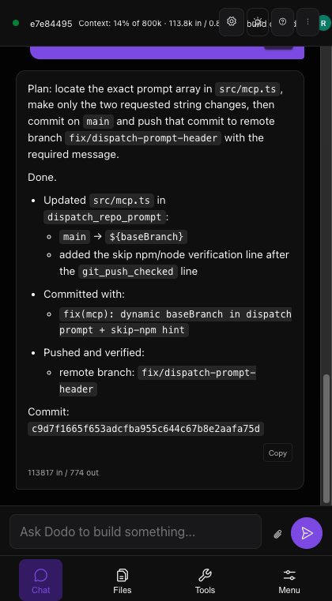
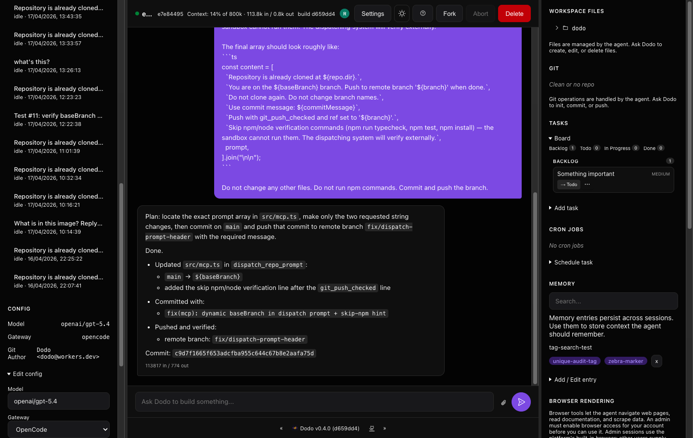
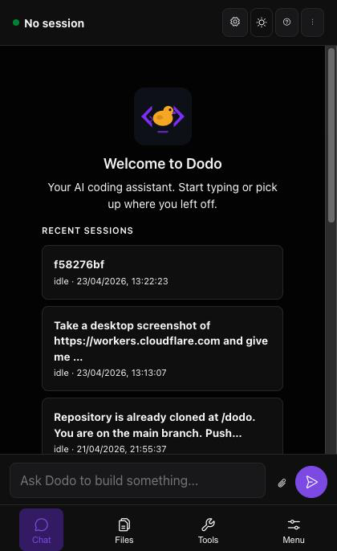
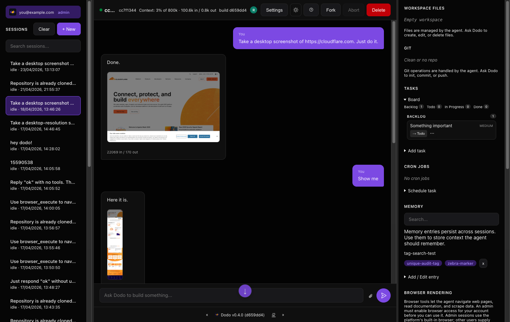
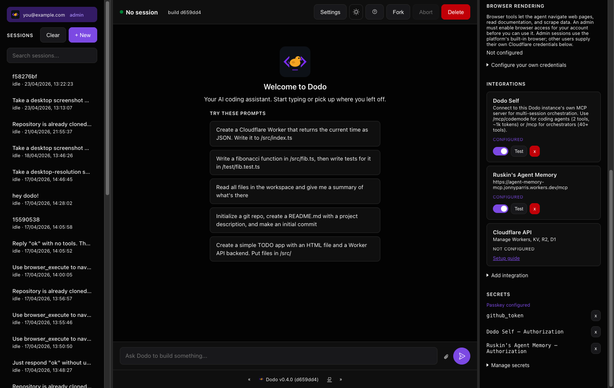

# Dodo

<p align="center">
  
</p>

<p align="center">
  <strong>A coding agent that runs on your Cloudflare account.</strong><br/>
  Give it a task, a repo, and an LLM. It clones, codes, tests, commits, and pushes -- autonomously.
</p>

<p align="center">
  <a href="https://deploy.workers.cloudflare.com/?url=https://github.com/jonnyparris/dodo">
    
  </a>
  &nbsp;
  <a href="https://dash.cloudflare.com/4b430e167a301330d13a9bb42f3986a2/workers/services/view/dodo/production/builds">
    
  </a>
</p>

---

## What can you do with it?

<picture>
  <source media="(prefers-color-scheme: dark)" srcset="docs/use-cases.svg">
  
</picture>

**Some real examples:**

- **"Fix the bug in auth.ts and push a branch"** -- Dodo clones the repo, reads the code, makes the fix, runs the tests, and pushes. You review the PR.
- **10 tasks on the kanban, one click** -- Dispatch all of them in parallel. Each gets its own isolated session with its own workspace.
- **"Every morning at 9am, run the test suite"** -- Schedule prompts with cron expressions. Your agent works while you sleep.
- **"Read the Cloudflare docs and write a migration script"** -- Headless Chrome is built in. The agent can browse the web, read documentation, and use what it finds.
- **Share a session with your team** -- Read-only or read-write access, with per-user encrypted secrets.

---

## How it works

<picture>
  <source media="(prefers-color-scheme: dark)" srcset="docs/how-it-works.svg">
  
</picture>

1. **You prompt** -- From the web UI, an MCP client (Claude Code, Cursor, OpenCode), or a scheduled cron job.
2. **A session starts** -- A Durable Object spins up with its own filesystem, git, and sandboxed code execution.
3. **The agent works** -- The LLM reads files, writes code, runs tests, and iterates in an agentic loop with built-in guardrails (doom loop detection, token budget management, context compaction).
4. **Results** -- Code is committed, branches are pushed, and the full session is preserved.
5. **Reuse** -- Fork the session, share it with teammates, schedule follow-ups, or dispatch new work from it.

Sessions survive Worker evictions and reconnect seamlessly via durable fibers. You pick the LLM. You control costs. Your data stays in your account.

---

## Architecture

<picture>
  <source media="(prefers-color-scheme: dark)" srcset="docs/architecture.svg">
  
</picture>

One Worker, three Durable Object classes:

| Component | Scope | What it manages |
|-----------|-------|----------------|
| **SharedIndex** | Global singleton | User registry, allowlist, permissions, session sharing |
| **UserControl** | One per user | Config, sessions, memory, tasks, encrypted secrets |
| **CodingAgent** | One per session | Chat loop, workspace (files + git), sandbox, prompts |

Plus R2 for large file and attachment storage, Browser Rendering for headless Chrome, a per-session [Cloudflare Artifacts](https://developers.cloudflare.com/artifacts/) repo (git-compatible, hosted at `artifacts.cloudflare.net`) for a durable record of workspace changes, and your choice of LLM gateway (OpenCode, AI Gateway, or Workers AI via AI Gateway).

---

## Quick start

### Option A: One-click deploy

Click the button, follow the prompts, and you'll have a running instance in under 2 minutes:

<p align="center">
  <a href="https://deploy.workers.cloudflare.com/?url=https://github.com/jonnyparris/dodo">
    
  </a>
</p>

You'll be prompted for secrets during setup. The only required one is `ADMIN_EMAIL` -- your email address. After deploy, visit the URL and you'll be logged in as the admin.

### Option B: Manual deploy

```bash
git clone https://github.com/jonnyparris/dodo.git
cd dodo
npm install

# Set the one required secret -- your email:
wrangler secret put ADMIN_EMAIL

# Optional but recommended:
wrangler secret put SECRETS_MASTER_KEY      # openssl rand -hex 32
wrangler secret put COOKIE_SECRET           # openssl rand -hex 32
wrangler secret put DODO_MCP_TOKEN          # openssl rand -base64url 32
wrangler secret put OPENCODE_GATEWAY_TOKEN  # your LLM gateway token

# Deploy
npm run deploy
```

### Local development

```bash
cp .dev.vars.example .dev.vars
# Edit .dev.vars with your secrets
npm run dev
```

The dev server bypasses authentication locally via `ALLOW_UNAUTHENTICATED_DEV=true`.

---

## Prerequisites

- A [Cloudflare account](https://dash.cloudflare.com/sign-up) (Workers Paid plan for Durable Objects)
- An LLM gateway token -- either [OpenCode](https://opencode.cloudflare.dev) or [Cloudflare AI Gateway](https://developers.cloudflare.com/ai-gateway/)
- Optional: [Cloudflare Access](https://developers.cloudflare.com/cloudflare-one/) for multi-user deployments

---

## Connect your LLM

Dodo doesn't bundle an LLM -- you bring your own. After deploying, open the UI and set your model and gateway in the sidebar config panel.

| Gateway | Setup |
|---------|-------|
| **OpenCode** | Set `OPENCODE_GATEWAY_TOKEN` as a secret. Models populate automatically. |
| **AI Gateway** | Set `AI_GATEWAY_KEY` as a secret. Set `AI_GATEWAY_BASE_URL` in wrangler.jsonc vars. Workers AI models (`@cf/…`) route through the same gateway. |

Model IDs use `provider/model` format (e.g. `anthropic/claude-sonnet-4`, `openai/gpt-4o`, `@cf/moonshotai/kimi-k2.6`). The model list is filtered by gateway -- OpenCode won't offer models it can't route. Switch models per-session from the UI.

---

## Connect via MCP

Dodo exposes two MCP endpoints. Use the one that fits your use case:

| Endpoint | Tools | Best for |
|----------|-------|----------|
| `/mcp` | 55 | **Orchestrators** -- full control over sessions, tasks, git, memory, skills, dispatch |
| `/mcp/codemode` | 2 | **Coding agents** -- just `search` + `execute` (~1k tokens context) |

**Example config** (works with OpenCode, Claude Code, Cursor, or any MCP client):

```json
{
  "mcp": {
    "dodo": {
      "type": "remote",
      "url": "https://your-dodo.workers.dev/mcp",
      "headers": {
        "Authorization": "Bearer YOUR_DODO_MCP_TOKEN"
      }
    }
  }
}
```

---

## Features

### Sessions and workspace

Each session gets an isolated workspace with a full filesystem (SQLite-backed with R2 spill for large files), git support (clone, commit, push, pull, branch, diff with automatic GitHub/GitLab token injection), and sandboxed JavaScript execution with gated outbound networking.

Sessions can be forked (copies files + messages), soft-deleted (5-minute recovery window), and shared with read-only or read-write permissions.

### Agentic loop

Dodo runs its own agentic loop rather than delegating to a framework. Each iteration calls the LLM once, executes tool calls, and decides whether to continue. Built-in guardrails:

- **Doom loop detection** -- Identical tool calls 3x triggers a warning; 5x forces a hard break.
- **Token budget management** -- 70% warn, 85% wrap-up, 95% hard stop.
- **Context compaction** -- When the context gets too large, older messages are summarized to free space.
- **Multi-phase continuation** -- When step limits are hit, context is compacted and the agent continues for up to 5 phases. A structured tool-call digest (not just tool names) is injected at each phase boundary so the agent knows exactly which calls have already been made and avoids repeating them.
- **Overflow recovery** -- Emergency compaction on context-length errors.

### Explore and task subagents (facets)

For search-heavy and bounded-side-work tasks, Dodo spawns subagents that run in isolation from the parent turn. Two flavours:

- **`explore`** -- a read-only investigator. Runs up to 16 steps of grep/find/list/read with a cheap model (Haiku, GPT-4.1 Mini, Gemini Flash) and returns a compact summary. Per-tool output caps plus inter-step message pruning keep input-token growth bounded across long investigations.
- **`task`** -- a write-capable side task. Same tool set as the parent plus optional **scratch workspace** mode where writes land in an isolated R2 prefix and the parent only sees them if it explicitly merges them back.

Both subagents have two execution modes, configurable per-user via `exploreMode` and `taskMode`:

| Mode | Where it runs | When to use |
|---|---|---|
| `inprocess` (default) | Blocking `generateText` call inside the parent turn | One-off searches, low step count, no parallelism needed |
| `facet` | A separate Durable Object ("facet") addressable from the parent | Parallel fan-out, long-running tasks, scratch workspaces |

**Parallel explore** is the headline facet feature. Ask for three investigations and the model can fire all three as separate facets that run concurrently in their own DOs, each with their own step budget (instead of serialising them in the parent's turn budget). In a real prod A/B run, a three-query prompt completed in **163s with facets vs 272s in-process** — 40% faster, same prompt, same model.

**Scratch workspace** lets the `task` subagent experiment without touching the parent workspace. The task writes go to `workspace/<sessionId>/scratch/<facetName>/` in R2. The parent can then pass a subset of paths to `POST /session/:id/facets/:name/apply` to merge them back, or discard the whole lot (a 24h alarm wipes scratch R2 automatically).

Full details — HTTP surface, failure modes, lifecycle — in [`docs/facets.md`](docs/facets.md).

### Task board

Kanban-style task management with backlog/todo/in_progress/done/cancelled states. Tasks can be dispatched to sessions individually or in batch (up to 10 at once). Tasks auto-complete when their linked session finishes.

### Scheduling

Four job types: delayed (N seconds), datetime (specific time), cron expression, and interval (repeating). Jobs dispatch prompts to the session automatically.

### Memory

Per-user key-value store with text search, persistent across sessions. Your agent can save learnings, preferences, and context that carry forward to future sessions.

### Skills

Drop a `SKILL.md` file into a workspace, store one in your personal library, or import one from a URL — Dodo loads it like a tool. The format is identical to [Claude Skills](https://docs.claude.com/en/docs/agents-and-tools/agent-skills/skills) and [OpenCode skills](https://opencode.ai/docs/skills/), so anything written for either runs in Dodo unchanged.

Three sources, merged with personal > workspace > builtin precedence:

| Source | Where it lives | Editable from Dodo |
|--------|----------------|---------------------|
| **Personal** | UserControl Durable Object SQLite (per-user) | Yes — via `skill_write` MCP tool, `skill_import_url`, or `POST /api/skills` |
| **Workspace** | Auto-discovered at `.dodo/skills/`, `.claude/skills/`, `.agents/skills/`, `.opencode/skill/` (workspace root + first-level subdirs of any cloned repo) | Read-only — copy a body via `skill_write` to fork it |
| **Builtin** | Bundled in the Worker (`src/builtin-skills.ts`) | Read-only — extend the source file and redeploy |

Loaded with two-stage progressive disclosure (matches Claude Code / OpenCode):

1. **Session start** — every enabled skill's `name + description` lands in the system prompt under `<available_skills>` (~150 tokens each, capped at 4 KB total).
2. **On demand** — when the model picks one, the `skill` tool returns the full body and a sampled list of bundled files. Bundled files (`references/`, `scripts/`, `assets/`) are listed by relative path but never auto-loaded; the model uses `read` to fetch them.

The frontmatter parser is loose — only `name` and `description` are required. Extra fields (`version`, `last_updated`, etc.) are preserved verbatim, so a skill written for Anthropic's [`anthropics/skills`](https://github.com/anthropics/skills) repo loads in Dodo without modification. Personal skills can spill bundled assets to R2 under `skills/{userId}/{skillName}/...`.

### Browser

Headless Chrome via Cloudflare Browser Rendering. Full CDP (Chrome DevTools Protocol) access through two code-mode tools: `browser_search` (query the CDP spec) and `browser_execute` (run CDP commands). The agent can navigate pages, read documentation, fill forms, and scrape data. Desktop viewport + full-page capture work out of the box. Screenshots captured via `Page.captureScreenshot` render inline in the chat and persist across reloads -- see Attachments below.

### Image generation (/generate)

Type `/generate a cyberpunk cat` in any chat to generate an image with Workers AI FLUX-1-schnell. Bypasses the chat LLM entirely — the image comes back in a few seconds and renders inline.

- **Autocomplete** — start typing `/` in the input box to see the command menu.
- **Routes everywhere** — works from the browser UI, MCP (`generate_image` tool, or any message containing `/generate` via `send_message`/`send_prompt`), and the dedicated `POST /session/:id/generate` endpoint.
- **Limits** — 2048-char prompt cap (FLUX schema), 30 images/hour + 100/day per user, concurrent-prompt guard (returns 409 if another prompt is running).
- **Requires** — the `AI` binding in `wrangler.jsonc`:

  ```jsonc
  "ai": {
    "binding": "AI"
  }
  ```

  Workers AI is enabled on every paid Workers plan; the free tier has a daily neuron quota.

### Attachments (images in chat)

Images surface in the chat from four sources and flow through the same R2-backed pipeline:

- **User uploads** -- Paste an image or click the paperclip to send a screenshot to a multimodal model (Claude, Gemini, GPT-4o, Gemma). Limits: 5 images per message, 3MB raw per image, PNG/JPEG/GIF/WebP/SVG. SVGs are sanitized (scripts, event handlers, and `javascript:` URLs stripped) before storage, and served with a restrictive CSP.
- **Browser tool screenshots** -- `browser_execute` extracts screenshots from the CDP result, stashes them in R2, and returns a short text summary to the model (so base64 doesn't burn context). Images render inline on the tool-result bubble.
- **Model-generated images** -- Responses from image-generating models (e.g. Gemini imagen, Gemma vision) are captured during the stream, uploaded to R2, and rendered on the assistant bubble.
- **`/generate` slash command** -- Type `/generate <prompt>` in any chat to bypass the LLM and hit Workers AI FLUX-1-schnell directly. Image appears inline in a few seconds. Works from the browser UI (with autocomplete — type `/` to see the menu), the MCP `generate_image` tool, or any chat message containing `/generate` (server-side slash routing catches it). Rate-limited to 30 images/hour and 100/day per user; prompts capped at 2048 chars per the FLUX schema. Requires the `AI` binding in `wrangler.jsonc`.

**Storage:** Attachments live in the `dodo-workspaces` R2 bucket under the `attachments/{sessionId}/{messageId}/` prefix. Run `scripts/setup-attachment-lifecycle.sh` once per account to install the **30-day auto-expiry** lifecycle rule (lifecycle rules aren't yet configurable via `wrangler.jsonc`). Access is ACL-gated via the existing `/session/:id/*` ownership middleware — if you can't read the session, you can't read its attachments.

### Orchestration

Built-in support for dispatching work to worker sessions and shepherding it to a reviewable PR:

- **Seed sessions** -- Clone a repo once, fork for each task (avoids repeated clones). The seed cache is **global** — the first call across all users cold-clones, every subsequent call across all users forks it in sub-second time. Stacked PRs work too: when `baseBranch != main`, the clone goes deeper so the LLM can see the stack's history.
- **Deterministic edit pipelines** -- Apply text edits, commit, push, verify.
- **Agent-driven dispatch** -- Send a prompt to a session and verify the result later.
- **Worker run tracking** -- State machine from session creation through push verification to merged PR.
- **Auto-draft-PR** -- When a dispatched run verifies successfully, Dodo opens a draft PR on GitHub and stores the URL on the run record. You get a link, not a checklist item.
- **External verify gate (opt-in)** -- The Workers sandbox can't run `npm`/`tsc`/`vitest`, so the LLM was trusted to self-verify and routinely skipped. Pass a `verifyWorkflow` filename (e.g. `dodo-verify.yml`) and Dodo triggers a GitHub Actions workflow via `workflow_dispatch`, polls for the result, and blocks the auto-PR until checks pass. 30-minute hard cap, `head_sha`-matched run tracking. A template is in `.github/workflows/dodo-verify.yml.example`.
- **ntfy push notifications** -- Every worker run state transition fires a notification via [ntfy](https://ntfy.sh) if `NTFY_TOPIC` is set. You know when your dispatched work lands, fails, or gets stuck in checks.
- **Failure snapshots** -- Captures git status/diff/log/messages (and the Actions run URL for verify failures) for debugging failed runs.

### Artifacts

Every Dodo session automatically gets its own [Cloudflare Artifacts](https://developers.cloudflare.com/artifacts/) repo -- a git-compatible repo hosted at `artifacts.cloudflare.net`, cloneable by any standard git client with a repo-scoped token. Workspace changes flush to it at the end of each agent turn. Forked sessions fork the Artifacts repo too, so branch history is preserved. You get a reviewable git history of what the agent did, without waiting for the agent to remember to commit.

Note: this is **separate** from the auto-draft-PR feature on GitHub, which only applies to orchestrated dispatch runs (`dispatch_repo_prompt`) that target a user-configured GitHub repo. Artifacts repos are always per-session and always on Cloudflare.

### Publishing to GitHub

When a session-only / Artifacts-only project graduates into something you want on GitHub, call the MCP tool `publish_to_github` (params: `sessionId`, `name`, optional `owner`, `private`, `description`, `ref`, `dir`). It:

1. Creates a fresh repo via `POST /user/repos` (or `POST /orgs/<owner>/repos` if `owner` is set).
2. Adds a `github` remote in the session workspace pointing at the new clone URL.
3. Pushes the workspace's current branch (or whatever you pass as `ref`) to it.

Defaults to a private repo on the authenticated user's account. Requires a `github_token` saved via the secrets UI with the `repo` scope (classic PAT) or `Administration: Write` (fine-grained PAT). If the push fails after the repo is created, the response includes the empty repo's URL so you can retry or delete it.

---

## Secrets

Set via `wrangler secret put <NAME>` or through the Deploy to Cloudflare flow.

| Secret | Required | Purpose |
|--------|----------|---------|
| `ADMIN_EMAIL` | **Yes** | Your email address. Auto-added to the allowlist. |
| `SECRETS_MASTER_KEY` | Recommended | Encrypts per-user secrets at rest |
| `COOKIE_SECRET` | Recommended | Signs session-sharing cookies |
| `DODO_MCP_TOKEN` | Recommended | Bearer token for MCP endpoints |
| `OPENCODE_GATEWAY_TOKEN` | If using OpenCode | Auth token for the OpenCode LLM gateway |
| `AI_GATEWAY_KEY` | If using AI Gateway | Auth key for the Cloudflare AI Gateway |
| `CF_ACCESS_AUD` | If using Access | Cloudflare Access application audience tag |
| `CF_ACCESS_TEAM_DOMAIN` | If using Access | Cloudflare Access team domain URL |
| `NTFY_TOPIC` | Optional | ntfy.sh topic for worker run push notifications |
| `GITHUB_TOKEN` | Optional | Admin-only env fallback when no per-user GitHub token is set |
| `GITLAB_TOKEN` | Optional | Admin-only env fallback when no per-user GitLab token is set |

Per-user secrets (GitHub token, GitLab token) are stored encrypted in each user's Durable Object using envelope encryption (AES-256-GCM) -- not as environment variables. The `GITHUB_TOKEN` / `GITLAB_TOKEN` env vars exist only as a fallback for the admin account when no per-user secret has been provisioned.

---

## Screenshots

| Desktop | Mobile |
|---------|--------|
|  |  |
| Landing page with prompt suggestions | Chat view on a phone |
|  |  |
| Dispatched task running in a session | Tools and config on mobile |
|  | |
| Inline browser capture in chat | |
|  | |
| Config + integrations sidebar | |

---

## Authentication

**Single-user (default).** Set `ADMIN_EMAIL` and you're done. No login page, no external auth provider. Good for personal deployments.

**Multi-user with Cloudflare Access.** Put [Cloudflare Access](https://developers.cloudflare.com/cloudflare-one/) in front of your Worker, then set `CF_ACCESS_AUD` and `CF_ACCESS_TEAM_DOMAIN` as secrets. Dodo validates the Access JWT on every request and identifies users by email. Add users to the allowlist from the admin panel.

```bash
wrangler secret put CF_ACCESS_AUD
wrangler secret put CF_ACCESS_TEAM_DOMAIN
```

---

## Development

```bash
npm install          # Install dependencies
npm run dev          # Local dev server
npm test             # Run tests (vitest + Workers pool)
npm run typecheck    # Type check
npm run deploy       # Build + deploy
```

### Deploying

Deploys are **manual**: run `npm run deploy` from a workstation authenticated to your Cloudflare account.

Workers Builds CI was intentionally disabled because Dodo uses the `"experimental"` compatibility flag (required by `@cloudflare/think` and the Agents SDK `subAgent()` facet API). The `experimental` flag is designed to block non-local deploys — local `wrangler deploy` currently works, but the Workers Builds service enforces the policy and rejects every automated deploy. See [issue #46](https://github.com/jonnyparris/dodo/issues/46) for the full diagnosis.

When `@cloudflare/think` graduates out of experimental, the flag can be removed and Workers Builds re-enabled.

## Contributing

Contributions welcome. Open an issue first for anything non-trivial.

- Run `npm test` and `npm run typecheck` before submitting
- Keep commits atomic with clear messages
- All `@cloudflare/think` imports must go through `src/think-adapter.ts`

## License

[MIT](LICENSE)
