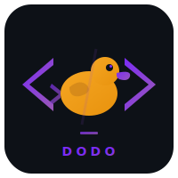

# Dodo

<p align="center">
  
</p>

<p align="center">Self-hostable autonomous coding agent on Cloudflare Workers + Durable Objects.</p>

## What it does

Dodo is a turnkey coding agent backend and UI. Each session gets its own Durable Object built on `@cloudflare/think` — providing persistent message storage, an agentic chat loop, workspace tools, sandboxed code execution, and durable fibers for async prompt recovery. Per-user state (config, sessions, memory, tasks, encrypted secrets) lives in a UserControl DO. A shared index manages the user allowlist, host allowlist, and models cache.

## Features

- **Sessions** -- create, list, delete, fork sessions with full state
- **Chat** -- `POST /session/:id/message` for synchronous callers, `POST /session/:id/prompt` for UI-driven prompt execution with abort
- **Think-backed persistence** -- messages stored via Think's SessionManager with sidecar metadata (author, model, provider, token counts)
- **Durable fibers** -- async prompts survive DO eviction via replay-from-checkpoint recovery
- **Workspace** -- file CRUD, search, in-file replace via `@cloudflare/shell` (SQLite + optional R2 spill)
- **Code execution** -- sandboxed JS via `createExecuteTool()` with workspace + git providers
- **Git** -- init, clone, add, commit, branch, checkout, pull, push, diff, remote (isomorphic-git)
- **Git auth** -- automatic token injection for GitHub/GitLab via per-user encrypted secrets or env fallback
- **Cron** -- schedule delayed, cron, or interval tasks that run prompts
- **Session forking** -- snapshot files + messages into a new session (v1 and v2 format)
- **Config** -- per-session model config via Think.configure(), switchable LLM gateway
- **Allowlist** -- manage outbound hostnames the sandbox can access
- **Memory** -- per-user key-value memory store with text search
- **Tasks** -- per-user Kanban backlog with auto-dispatch to sessions
- **Secrets** -- encrypted per-user secret storage (envelope encryption with passkey + server key)
- **MCP** -- Model Context Protocol server exposing all tools (sessions, files, git, memory, tasks)
- **MCP configs** -- per-user MCP server configurations with encrypted header secrets
- **Notifications** -- push notifications via ntfy.sh on completion/failure
- **SSE** -- real-time event stream per session for text deltas, messages, state, files, prompts, execution
- **WebSocket** -- presence tracking, typing indicators, and session events broadcast to all connected clients
- **Session sharing** -- share tokens with readonly/readwrite permissions, expiration, and revocation
- **Web UI** -- three-panel responsive app: session list + config, chat, workspace + git + prompts + cron + memory + secrets
- **Auth** -- Cloudflare Access JWT verification, user allowlist, admin controls
- **Multi-tenant** -- per-user isolation via UserControl DOs, admin user management

## Commands

```bash
npm install
npm run typecheck
npm test
npm run dev
npm run deploy
```

## Secrets (via `wrangler secret put`)

| Secret | Purpose |
|--------|---------|
| `OPENCODE_GATEWAY_TOKEN` | Auth token for the OpenCode gateway |
| `AI_GATEWAY_KEY` | Auth key for the AI Gateway fallback |
| `SECRETS_MASTER_KEY` | 32-byte hex key for server-side envelope encryption |
| `DODO_MCP_TOKEN` | Bearer token for MCP endpoint auth |

Per-user secrets (GitHub token, GitLab token, ntfy topic, gateway token) are stored encrypted in each user's UserControl DO after passkey onboarding.

## Architecture

```
Worker (Hono router + CF Access auth)
+-- SharedIndex DO (global singleton)
|   +-- users, host_allowlist, models_cache, session_shares, session_permissions
+-- UserControl DO (one per user, idFromName(email))
|   +-- user_config, sessions, memory_entries, tasks
|   +-- key_envelope, encrypted_secrets (envelope encryption)
|   +-- fork_snapshots, mcp_configs
+-- CodingAgent DO (one per session, extends Think<Env, DodoConfig>)
|   +-- Think-managed: assistant_sessions, assistant_messages, _think_config, cf_agents_fibers
|   +-- Dodo-owned: metadata, message_metadata, prompts, cron_jobs, approval_queue
|   +-- Workspace (@cloudflare/shell, SQLite + optional R2 spill)
|   +-- createExecuteTool (@cloudflare/think/tools/execute, gated outbound)
|   +-- One Think session per DO (single-session invariant)
|   +-- Durable fibers for async prompt recovery
+-- AllowlistOutbound (WorkerEntrypoint, gated sandbox fetch)
+-- AppControl DO (legacy, kept for migration)
```

### Key design decisions

- **One Think session per Dodo DO.** Think's multi-session capabilities are not exposed to users. `ensureSingleThinkSession()` enforces this invariant.
- **Per-session config.** Model/gateway settings are stored in Think config, not injected per-request.
- **Dodo-level snapshots/forks.** Think's `SessionManager.fork()` is not used for user-visible branching. Dodo forks clone files plus transcript into a new DO.
- **Suppressed WebSocket chat protocol.** Think's `cf_agent_chat_*` handlers are intercepted and dropped to prevent a parallel chat path.
- **Fibers replay from scratch.** On recovery, the fiber method re-runs from the beginning and uses `stashFiber()` checkpoints and `snapshot.chatCompleted` to skip completed work.
- **Message metadata sidecar.** Think stores core messages; Dodo stores author/model/provider/tokens in `message_metadata` table.
- **Git token hierarchy.** Per-user encrypted secrets (`github_token`, `gitlab_token`) are tried first, then env vars (`GITHUB_TOKEN`, `GITLAB_TOKEN`).
- **MCP header encryption.** Config stores header names in `headers_json`; actual values stored as `mcp:{configId}:{headerName}` encrypted secrets.
- **Streaming UI.** The web UI appends raw text deltas immediately, then upgrades the message to markdown a few times per second so long responses stay responsive.
- **Build visibility.** The header shows the deployed build hash when `DODO_COMMIT` is present, which makes it easier to confirm which revision a user is running.

## License

MIT
