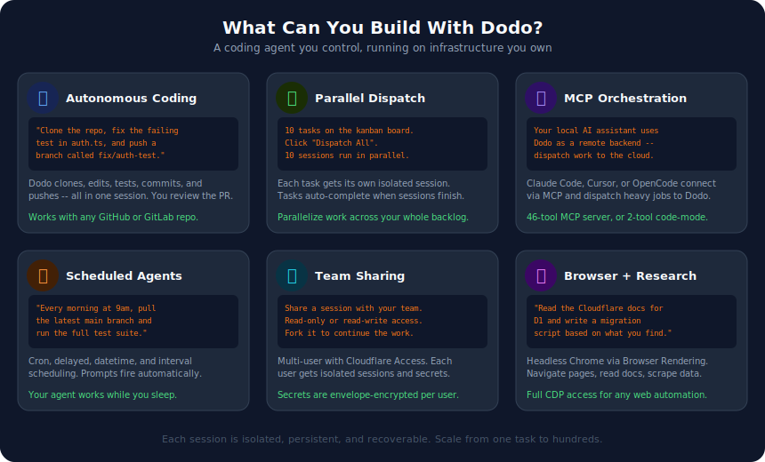
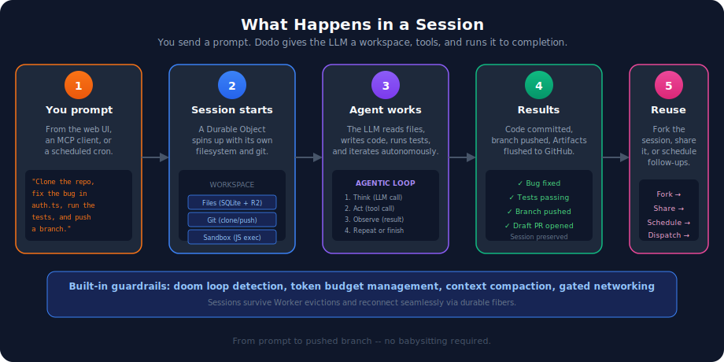
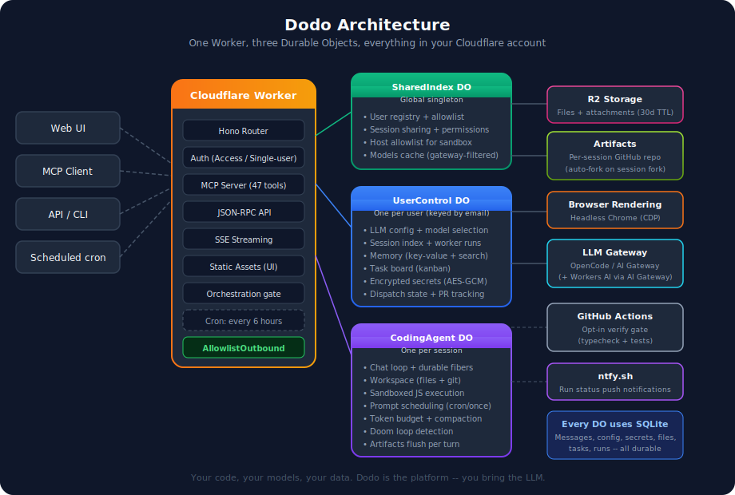

# Dodo

<p align="center">
  
</p>

<p align="center">
  <strong>A coding agent that runs on your Cloudflare account.</strong><br/>
  Give it a task, a repo, and an LLM. It clones, codes, tests, commits, and pushes -- autonomously.
</p>

<p align="center">
  <a href="https://deploy.workers.cloudflare.com/?url=https://github.com/jonnyparris/dodo">
    
  </a>
  &nbsp;
  <a href="https://dash.cloudflare.com/4b430e167a301330d13a9bb42f3986a2/workers/services/view/dodo/production/builds">
    
  </a>
</p>

---

## What can you do with it?

<picture>
  <source media="(prefers-color-scheme: dark)" srcset="docs/use-cases.svg">
  
</picture>

**Some real examples:**

- **"Fix the bug in auth.ts and push a branch"** -- Dodo clones the repo, reads the code, makes the fix, runs the tests, and pushes. You review the PR.
- **10 tasks on the kanban, one click** -- Dispatch all of them in parallel. Each gets its own isolated session with its own workspace.
- **"Every morning at 9am, run the test suite"** -- Schedule prompts with cron expressions. Your agent works while you sleep.
- **"Read the Cloudflare docs and write a migration script"** -- Headless Chrome is built in. The agent can browse the web, read documentation, and use what it finds.
- **Share a session with your team** -- Read-only or read-write access, with per-user encrypted secrets.

---

## How it works

<picture>
  <source media="(prefers-color-scheme: dark)" srcset="docs/how-it-works.svg">
  
</picture>

1. **You prompt** -- From the web UI, an MCP client (Claude Code, Cursor, OpenCode), or a scheduled cron job.
2. **A session starts** -- A Durable Object spins up with its own filesystem, git, and sandboxed code execution.
3. **The agent works** -- The LLM reads files, writes code, runs tests, and iterates in an agentic loop with built-in guardrails (doom loop detection, token budget management, context compaction).
4. **Results** -- Code is committed, branches are pushed, and the full session is preserved.
5. **Reuse** -- Fork the session, share it with teammates, schedule follow-ups, or dispatch new work from it.

Sessions survive Worker evictions and reconnect seamlessly via durable fibers. You pick the LLM. You control costs. Your data stays in your account.

---

## Architecture

<picture>
  <source media="(prefers-color-scheme: dark)" srcset="docs/architecture.svg">
  
</picture>

One Worker, three Durable Object classes:

| Component | Scope | What it manages |
|-----------|-------|----------------|
| **SharedIndex** | Global singleton | User registry, allowlist, permissions, session sharing |
| **UserControl** | One per user | Config, sessions, memory, tasks, encrypted secrets |
| **CodingAgent** | One per session | Chat loop, workspace (files + git), sandbox, prompts |

Plus R2 for large file storage, Browser Rendering for headless Chrome, and your choice of LLM gateway.

---

## Quick start

### Option A: One-click deploy

Click the button, follow the prompts, and you'll have a running instance in under 2 minutes:

<p align="center">
  <a href="https://deploy.workers.cloudflare.com/?url=https://github.com/jonnyparris/dodo">
    
  </a>
</p>

You'll be prompted for secrets during setup. The only required one is `ADMIN_EMAIL` -- your email address. After deploy, visit the URL and you'll be logged in as the admin.

### Option B: Manual deploy

```bash
git clone https://github.com/jonnyparris/dodo.git
cd dodo
npm install

# Set the one required secret -- your email:
wrangler secret put ADMIN_EMAIL

# Optional but recommended:
wrangler secret put SECRETS_MASTER_KEY      # openssl rand -hex 32
wrangler secret put COOKIE_SECRET           # openssl rand -hex 32
wrangler secret put DODO_MCP_TOKEN          # openssl rand -base64url 32
wrangler secret put OPENCODE_GATEWAY_TOKEN  # your LLM gateway token

# Deploy
npm run deploy
```

### Local development

```bash
cp .dev.vars.example .dev.vars
# Edit .dev.vars with your secrets
npm run dev
```

The dev server bypasses authentication locally via `ALLOW_UNAUTHENTICATED_DEV=true`.

---

## Prerequisites

- A [Cloudflare account](https://dash.cloudflare.com/sign-up) (Workers Paid plan for Durable Objects)
- An LLM gateway token -- either [OpenCode](https://opencode.cloudflare.dev) or [Cloudflare AI Gateway](https://developers.cloudflare.com/ai-gateway/)
- Optional: [Cloudflare Access](https://developers.cloudflare.com/cloudflare-one/) for multi-user deployments

---

## Connect your LLM

Dodo doesn't bundle an LLM -- you bring your own. After deploying, open the UI and set your model and gateway in the sidebar config panel.

| Gateway | Setup |
|---------|-------|
| **OpenCode** | Set `OPENCODE_GATEWAY_TOKEN` as a secret. Models populate automatically. |
| **AI Gateway** | Set `AI_GATEWAY_KEY` as a secret. Set `AI_GATEWAY_BASE_URL` in wrangler.jsonc vars. |

Model IDs use `provider/model` format (e.g. `anthropic/claude-sonnet-4`, `openai/gpt-4o`). Switch models per-session from the UI.

---

## Connect via MCP

Dodo exposes two MCP endpoints. Use the one that fits your use case:

| Endpoint | Tools | Best for |
|----------|-------|----------|
| `/mcp` | 46 | **Orchestrators** -- full control over sessions, tasks, git, memory |
| `/mcp/codemode` | 2 | **Coding agents** -- just `search` + `execute` (~1k tokens context) |

**Example config** (works with OpenCode, Claude Code, Cursor, or any MCP client):

```json
{
  "mcp": {
    "dodo": {
      "type": "remote",
      "url": "https://your-dodo.workers.dev/mcp",
      "headers": {
        "Authorization": "Bearer YOUR_DODO_MCP_TOKEN"
      }
    }
  }
}
```

---

## Features

### Sessions and workspace

Each session gets an isolated workspace with a full filesystem (SQLite-backed with R2 spill for large files), git support (clone, commit, push, pull, branch, diff with automatic GitHub/GitLab token injection), and sandboxed JavaScript execution with gated outbound networking.

Sessions can be forked (copies files + messages), soft-deleted (5-minute recovery window), and shared with read-only or read-write permissions.

### Agentic loop

Dodo runs its own agentic loop rather than delegating to a framework. Each iteration calls the LLM once, executes tool calls, and decides whether to continue. Built-in guardrails:

- **Doom loop detection** -- Identical tool calls 3x triggers a warning; 5x forces a hard break.
- **Token budget management** -- 70% warn, 85% wrap-up, 95% hard stop.
- **Context compaction** -- When the context gets too large, older messages are summarized to free space.
- **Multi-phase continuation** -- When step limits are hit, context is compacted and the agent continues for up to 5 phases.
- **Overflow recovery** -- Emergency compaction on context-length errors.

### Explore subagent

For search-heavy tasks, Dodo spawns a lightweight read-only subagent (Haiku/GPT-4.1 Mini/Gemini Flash) that runs up to 5 steps of grep/find/list/read and returns a compact summary. Saves 5-20x tokens compared to dumping raw file contents into the main context.

### Task board

Kanban-style task management with backlog/todo/in_progress/done/cancelled states. Tasks can be dispatched to sessions individually or in batch (up to 10 at once). Tasks auto-complete when their linked session finishes.

### Scheduling

Four job types: delayed (N seconds), datetime (specific time), cron expression, and interval (repeating). Jobs dispatch prompts to the session automatically.

### Memory

Per-user key-value store with text search, persistent across sessions. Your agent can save learnings, preferences, and context that carry forward to future sessions.

### Browser

Headless Chrome via Cloudflare Browser Rendering. Full CDP (Chrome DevTools Protocol) access through two code-mode tools: `browser_search` (query the CDP spec) and `browser_execute` (run CDP commands). The agent can navigate pages, read documentation, fill forms, and scrape data. Screenshots captured via `Page.captureScreenshot` render inline in the chat — see Attachments below.

### Attachments (images in chat)

Images surface in the chat from three sources and flow through the same R2-backed pipeline:

- **User uploads** -- Paste an image or click the paperclip to send a screenshot to a multimodal model (Claude, Gemini, GPT-4o, Gemma). Limits: 5 images per message, 3MB raw per image, PNG/JPEG/GIF/WebP.
- **Browser tool screenshots** -- `browser_execute` extracts screenshots from the CDP result, stashes them in R2, and returns a short text summary to the model (so base64 doesn't burn context). Images render inline on the tool-result bubble.
- **Model-generated images** -- Responses from image-generating models (e.g. Gemini imagen, Gemma vision) are captured during the stream, uploaded to R2, and rendered on the assistant bubble.

**Storage:** Attachments live in the `dodo-workspaces` R2 bucket under the `attachments/{sessionId}/{messageId}/` prefix. Run `scripts/setup-attachment-lifecycle.sh` once per account to install the **30-day auto-expiry** lifecycle rule (lifecycle rules aren't yet configurable via `wrangler.jsonc`). Access is ACL-gated via the existing `/session/:id/*` ownership middleware — if you can't read the session, you can't read its attachments.

### Orchestration

Built-in support for dispatching work to worker sessions:

- **Seed sessions** -- Clone a repo once, fork for each task (avoids repeated clones).
- **Deterministic edit pipelines** -- Apply text edits, commit, push, verify.
- **Agent-driven dispatch** -- Send a prompt to a session and verify the result later.
- **Worker run tracking** -- State machine from session creation through push verification.
- **Failure snapshots** -- Captures git status/diff/log/messages for debugging failed runs.

---

## Secrets

Set via `wrangler secret put <NAME>` or through the Deploy to Cloudflare flow.

| Secret | Required | Purpose |
|--------|----------|---------|
| `ADMIN_EMAIL` | **Yes** | Your email address. Auto-added to the allowlist. |
| `SECRETS_MASTER_KEY` | Recommended | Encrypts per-user secrets at rest |
| `COOKIE_SECRET` | Recommended | Signs session-sharing cookies |
| `DODO_MCP_TOKEN` | Recommended | Bearer token for MCP endpoints |
| `OPENCODE_GATEWAY_TOKEN` | If using OpenCode | Auth token for the OpenCode LLM gateway |
| `AI_GATEWAY_KEY` | If using AI Gateway | Auth key for the Cloudflare AI Gateway |
| `CF_ACCESS_AUD` | If using Access | Cloudflare Access application audience tag |
| `CF_ACCESS_TEAM_DOMAIN` | If using Access | Cloudflare Access team domain URL |

Per-user secrets (GitHub token, GitLab token) are stored encrypted in each user's Durable Object using envelope encryption (AES-256-GCM) -- not as environment variables.

---

## Authentication

**Single-user (default).** Set `ADMIN_EMAIL` and you're done. No login page, no external auth provider. Good for personal deployments.

**Multi-user with Cloudflare Access.** Put [Cloudflare Access](https://developers.cloudflare.com/cloudflare-one/) in front of your Worker, then set `CF_ACCESS_AUD` and `CF_ACCESS_TEAM_DOMAIN` as secrets. Dodo validates the Access JWT on every request and identifies users by email. Add users to the allowlist from the admin panel.

```bash
wrangler secret put CF_ACCESS_AUD
wrangler secret put CF_ACCESS_TEAM_DOMAIN
```

---

## Development

```bash
npm install          # Install dependencies
npm run dev          # Local dev server
npm test             # Run tests (vitest + Workers pool)
npm run typecheck    # Type check
npm run deploy       # Build + deploy
```

## Contributing

Contributions welcome. Open an issue first for anything non-trivial.

- Run `npm test` and `npm run typecheck` before submitting
- Keep commits atomic with clear messages
- All `@cloudflare/think` imports must go through `src/think-adapter.ts`

## License

[MIT](LICENSE)
